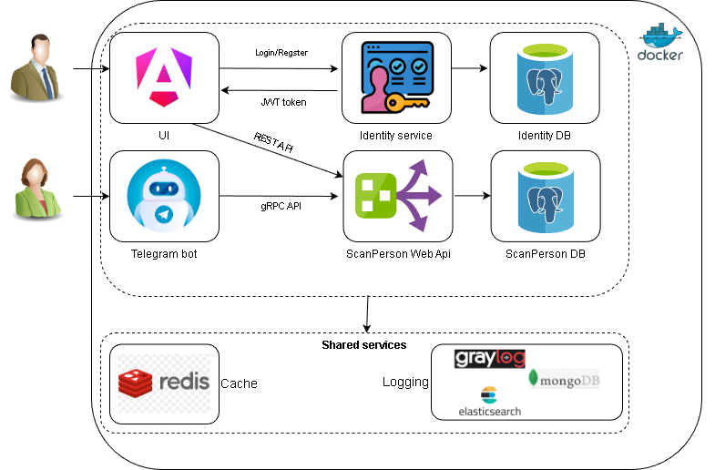

<!--О проекте-->
# ScanPerson 🌐
## О проекте
ScanPerson — это исследовательский проект для отработки навыков и тестирвоания, призванный продемонстрировать полный цикл разработки приложения "под ключ". Основная идея — создание многосервисной архитектуры на базе .NET Core 9 Web API с клиентской частью на Angular 17. 

Изначально приложение фокусируется на получении информации по номеру телефона, но архитектура предусматривает легкое расширение для поддержки других типов данных, таких как ФИО, номера документов, никнеймы, фотографии, анализ спам-активности и многое другое.

В будущем проект может трансформироваться в полезный инструмент для личного использования или даже стать основой для коммерческого сервиса.

## Цель проекта:
Разработка "под ключ": Демонстрация всех этапов создания приложения, от идеи до развертывания.

Многосервисная архитектура: Реализация масштабируемой архитектуры с использованием отдельных сервисов, взаимодействующих через Docker Compose.

CI/CD и автоматизация: Интеграция GitHub Actions для автоматизации сборки, тестирования и развертывания.

Качество кода: Использование SonarQube для анализа качества кода, а та же code coverage с 80% требованием покрытия кода.

Гибкость и расширяемость: Заложена возможность добавления новых сервисов и функций в будущем, включая:

- Получение информации по номеру телефона.
- Расширение поиска по ФИО, номерам документов, автомобилей, никнеймам, фотографиям.
- Анализ спам-активности.
- Подключение к внешним сервисам.
- Возможность использовать WebApi из других приложений (в будущем планируется разработка мобильного приложение с использованием методов этого приложения).

## Архитектурные особенности:

🚀 Backend: Разработан на .NET Core 9 Web API и gRPC API.

💻 Frontend: Реализован с использованием Angular 17.

🐳 Контейнеризация: Все сервисы упакованы в Docker-контейнеры и оркестрируются с помощью Docker Compose.

🔌 Сетевое взаимодействие: Сервисы внутри Docker Compose общаются друг с другом через общую внутреннюю сеть.

Основные компоненты:

- ScanPerson Service: содержит интерфейс для взаимодействия через браузер и Api для взаимодействия, а так же основную логику проекта.
- Graylog Service: Выделен в отдельное решение для централизованного логирования.
- Identity Service: Реализован как отдельное решение для управления аутентификацией и авторизацией. В будущем планируется оздание HTTP-клиента для взаимодействия с ним.
- Shared Services: Сервисы общего назначения, такие как PgAdmin (для управления базами данных), Redis, RabbitMQ будут cобраны в отдельный "Shared" решение.
- Базы данных: Используются отдельные экземпляры баз данных для каждого сервиса (например, PostgreSQL для сервисов данных).
- TelegramBots WorkerServices: Добавлены для альтернативного подключения к ScanPerson Service.

## Цели в будущем:
Превратить проект в полезный инструмент для личного использования. А так же изучить возможности мобильной разработки использовать и добавить мобильное приложение, которое будет взаимодействовать с основными сервисами проекта.

Расширить функциональность приложения для получения разнообразной информации по различным идентификаторам.

Добавить интеграции с внешними API и сервисами.

## Установка и запуск 🔧
Предварительные требования:
Docker и Docker Compose: Убедитесь, что они установлены и работают.

.NET SDK 9: Установлен для сборки бэкенда.

Node.js и npm/yarn: Установлены для работы с Angular.

### Шаги установки:
Клонируйте репозиторий:

    git clone https://github.com/AlexSidy/Pet.git

Настройте переменные окружения:
Создайте файл .env в корневой директории каждого решения содержащего файл docker-compose.yml и заполните его необходимыми переменными (см. примеры в docker-compose.yml и файлах .env.example).

Сгенерируйте SSL-сертификат (если необходимо):
Для разработки вы можете использовать dotnet dev-certs.

### Создайте ssl сертификат для разработки и экспортируйте его
    mkdir -p ./https
    dotnet dev-certs https -ep ./https/certificate.pfx -p <ваш_пароль_к_сертификату> --trust
⚠️ Выберите свой путь к файлу и не забудьте обновить путь и пароль к сертификату в файле .env.

Соберите и запустите Docker Compose:

    cd <путь к репозиторию>

Запуск всех контейнеров в

bash

    find . -name "docker-compose.yml" -print0 | xargs -0 -I {} bash -c 'echo "--- Starting services for {} ---" && cd "$(dirname "{}")" && docker compose up -d --build'

или 

powershell

    Get-ChildItem -Recurse -Filter docker-compose.yml |
    ForEach-Object {
    $path = $_.FullName
    $dir  = $_.DirectoryName
    Write-Host "---- Starting services for $path ----"
    Push-Location $dir
    docker compose up -d --build
    Pop-Location
    }

  или для каждого решения по отдельности docker compose up -d --build

### Доступ к приложениям:
Frontend (Angular): http://localhost:4200 (или настроенный порт)

Backend ScanPerson API : Web API: http://localhost:8080 (HTTP), https://localhost:8081 (HTTPS);
gRPC API: https://localhost:5001 (Http2)

Identity API (identity API): http://localhost:8090 (HTTP), https://localhost:8091 (HTTPS)

PgAdmin: http://localhost:8000 (или настроенный порт)

Graylog: http://localhost:9000 (или настроенный порт)

TelegramBots: @ScanPersonUserBot

## CI/CD и Автоматизация ⚙️
Проект интегрирован с GitHub Actions для автоматизации процессов.

### CI Pipeline [CI github action](.github/workflows/GitHubActionCI.yml):
Запускается при создании Pull Request в ветки dev или main, а также при Push в main.

Шаги выполнения:
Клонирование кода.
Настройку .NET SDK.
Установку SonarScanner CLI.
Начальный анализ SonarQube (dotnet sonarscanner begin).
Восстановление зависимостей (dotnet restore).
Сборку проекта (dotnet build).
Запуск тестов и генерацию отчетов о покрытии кода (dotnet test).
Слияние отчетов о покрытии.
Завершающий анализ SonarQube (dotnet sonarscanner end).

### CD Pipeline [CD github action](.github/workflows/GitHubActionCD.yml):

Запускается после успешного завершения CI Pipeline при пуше в ветку main.

Выполняет развертывание на виртуальную машину:
Остановка и удаление предыдущих контейнеров, а так же образов и томов (настраивается через переменные репозитория).
Создание Docker сети (scanperson-network), если не была создана.
Смена прав доступа к директориям на VM.
Копирование файлов проекта на VM.
Генерация SSL-сертификатов на VM для разработки.
Пересборка и запуск всех Docker Compose сервисов.
Перезапуск контейнеров.

### Структура проекта 🌐

     Pet/
     ├── Identity/              # Identity Service
     │   ├── Identity.Api/
     │   └── Tests/
     ├── ScanPerson/            # Main Service
     │   ├── ScanPerson.WebApi/
     │   ├── ScanPerson.BusinessLogic/
     │   ├── ScanPerson.DAL/
     │   ├── ScanPerson.Models/
     │   ├── ScanPerson.Common/
     │   ├── ScanPerson.UI/     # Angular Frontend
     │   └── Tests/
     ├── TelegramBots/          # Telegram Bots Service
     │   ├── TelegramBots.WorkerServices/
     │   ├── TelegramBots.BusinessLogic/
     │   └── Tests/
     ├── Shared/                # Shared Infrastructure
     │   └── docker-compose.yml # Graylog, Redis, PgAdmin
     └── .github/
         └── workflows/         # CI/CD pipelines

### Расширение функционала 🏗️
Для расширения функционала обработки и получения дополнительной информации подразумевается добавление нового класса по пути ScanPerson.BusinessLogic\Services, унаследованного от [IPersonInfoService](ScanPerson.BusinessLogic/Services/Interfaces/IPersonInfoService.cs) , а так же покрытие этого класса тестами (см. пример классов [GeoService](ScanPerson/ScanPerson.BusinessLogic/Services/GeoService.cs) и [GeoServiceTests](ScanPerson/Tests/ScanPerson.Unit.Tests/GeoServiceTests.cs))

### Вклад и помощь 👋
Если вы хотите внести свой вклад в этот проект, пожалуйста, ознакомьтесь с [CONTRIBUTING.md](CONTRIBUTING.md) или свяжитесь с автором.

### Лицензия 📜
Этот проект распространяется под лицензией MIT. Подробнее см. файл [LICENSE](LICENSE).
